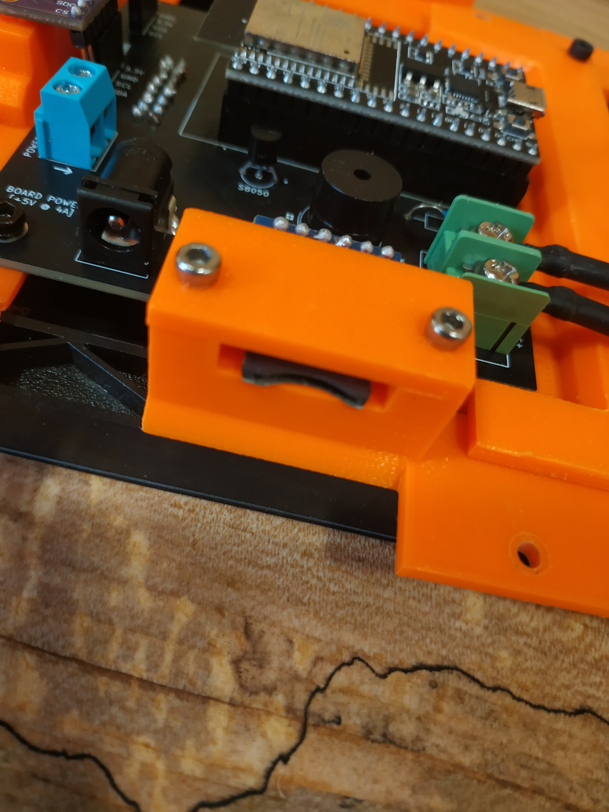
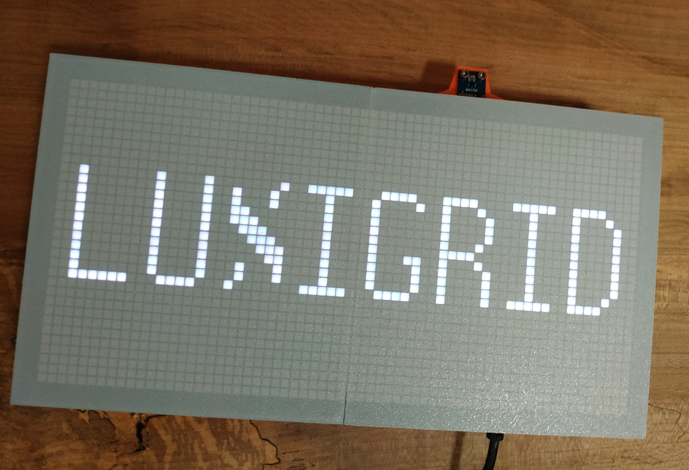

# Luxigrid - Assembly Documentation

This document presumes you have read the [Bill of Materials](./hardware/BOM.md) and the [3D Printing Documentation](./hardware/3D.md). They reference each other, but this document is primarily concerned with the physical assembly process.

**Please Note:** OverScore Media does not guarantee that any of this information is accurate or up-to-date. It is provided for informational purposes only, in the hope that it will be useful. Any images are for illustration only. If you choose to follow these instructions, you do so at your own risk. This is just to let you know what you might be in for. Please be careful.

## Procuring the PCB

Luxigrid uses a custom printed circuit board (PCB) at its heart. If you want to build a Luxigrid of your own, you will need to get one.

You can purchase just a PCB from [our website](https://luxigrid.overscore.media) (assembled or not assembled), or you can get it fabricated for you. As an open hardware design, you have access to all the files you should need to get the PCB fabricated. You also have access to the KiCad source files, if you want to make modifications to the PCB. You probably want to use the version without rounded traces to make adjustments to the design. Then you can use the wonderful [KiCad Round Tracks](https://github.com/mitxela/kicad-round-tracks) plugin by @mitxela to generate neat rounded traces. It's mostly a style thing, but we really like the look of it. It hearkens back to the days of designing PCBs by hand - but like, in a good way.

Anyway... let's assume you don't want to make modifications to the PCB design, and you just want to order some. Now, generally you can't order just one - many fabricators produce them in batches, with the smallest batch size often being 5 boards. Keep that in mind.

There are many places to order custom PCBs, like JLCPCB, PCBWay, OSHPark, Seeed Studio, Aisler, and others. Wherever you choose to get the boards made, you will need the **Gerber** files. For convenience, we have provided pre-generated Gerbers in a .zip file, in the `/hardware/pcb/gerbers` folder. Depending on the tolerances of your chosen manufacturer, you may want to adjust the settings and generate your own Gerbers from the included KiCad project. But these have worked for us with JLCPCB.

When ordering the boards, most manufacturers let you upload the Gerber files directly, and modify the options. If you're careful and not too picky, you can keep the price down. We recommend going with a 1.6mm board, Lead-Free HASL coating, and tented vias. Many manufacturers also let you choose the colour of the solder mask. We normally go with black, since it looks neat.

When choosing JLCPCB, we go with the "Order Number (Specify Position)" option. Hence the little "JLCJLCJLC" text on the back of the PCB design. That will be replaced with an order number by the factory. For reference, this is the order we usually go for with JLCPCB. Please note that OverScore Media is not specifically endorsing or disapproving any vendors here. We're simply relating a positive experience we had with JLCPCB for informational purposes.

## Populating the PCB

Once you've gotten a PCB of your own, you'll need to populate it with parts. See the [Bill of Materials](./hardware/BOM.md) for more info. But in short, you will need the following parts.

- 2x8 Female Dupont Header Pins
- 1x4 Female Dupont Header Pins (x3)
- 1x6 Female Dupont Header Pins
- 1x19 Female Dupont Header Pins (x2)
- 1K Resistor (x2)
- Passive Piezo Buzzer
- S8050 Transistor
- Screw Terminals (5mm pitch)
- Barrier Terminal Block (1x2, 7.62mm)
- Barrel Jack (rated for at least 5A)

When completed, it should look a little something like this. Please disregard the sketchy solder joints in a few places.

We recommend cross-referencing these photos to see if you're installing everything correctly. The white silkscreen text/outlines should also be helpful. Especially take note of the orientation of the transistor, with the flat side facing the long header pins for the ESP32, the "+" on the buzzer lining up with the little plus sign on the board, the terminal barrier block (green) within the white outline, and the screw terminals (teal) oriented inwards. Although the last one isn't that big of a deal, just be consistent. We just found it slightly more convenient to have it facing inwards.

You should probably solder the 2x8 connector for the LED matrix before putting the other headers and screw terminals nearby. Otherwise, as shown in the picture, it can get tricky to solder it last. Although it can be done.

You will want side cutters, or big scissors to snip off the leads of parts like the resistors and transistor before soldering them. Otherwise they'll be too long. See the picture of the backside of the board - they shouldn't be protruding that much.

The buzzer may need to have its pins carefully bent in order for it to fit. It shouldn't be an issue, as long as you orient the plus sign correctly.

For the header pins, try soldering one pin first, then make sure the block is lined up. Then do the opposite pin, and make sure the block is straight. You may have a chance to heat the solder up and tweak the position if necessary. Also, try to ensure the block is completely seated against the surface of the PCB. You shouldn't be able to see the brass pins between the plastic block and the PCB surface. Once the start and end pins have been soldered, you can solder the pins in the middle of the block. That usually works.

For the barrier terminal block, we recommend slightly loosening the screws before soldering it onto the PCB. Otherwise, they may move around a bit when initially loosening the screws, which is probably not ideal.

And for all these parts, don't forget a generous coating of flux. Regular rosin flux works pretty well, in our experience. It can leave a bit of a mess on the board when you're done. But a careful scrub with a toothbrush dipped in 99% isopropanol/rubbing alcohol can usually get it all off. Just don't brush your teeth with it afterwards! 😂 The alcohol may leave a slight white film on the surface of the PCB when it evaporates. As long as you got the worst of the flux off the board, that's probably not a big deal. It's hard to see with a black PCB, anyway. Just make sure you let the board thoroughly dry after cleaning, and before hooking it up.

## Printing the Parts

As mentioned above, the [3D Printing Documentation](./hardware/3D.md) goes into more detail on the 3D printed parts you'll need to assemble the Luxigrid enclosure, and how to print them properly. It's not the easiest process, but we've tried to make it as repeatable and dependable as possible. You may want to print some test parts to experiment with the fit of everything, first.

We would also recommend getting used to the process of inserting heated inserts into a plastic part. You will need four M3 inserts in each of the two matrix diffusers, as well as two M4 inserts into the right backplane. Read more about the specific parts/tools you'll need in the [Bill of Materials](./hardware/BOM.md).

To reiterate, you will need roughly 400g of 3D printer filament and 21 hours of printing time to complete the parts for a Luxigrid enclosure. You will also need to be able to do per-layer colour changes, since the matrix diffusers require specific layers of white and black plastic in order to function.

But once you have a populated PCB, the 3D-printed parts, and the required fasteners, there are just a couple more matters of business before we can put this whole thing together

## Prepping the Parts

The two last main preparation steps are getting the power switch ready, and installing the heated inserts in the 3D printed parts that require them.

You may also want to install a mesh to cover the "vents" or windows on the back of the enclosure. It's an optional step, but it can help prevent dust build-up inside the enclosure, and it looks pretty neat.

Anyway, for the power switch, you'll want to solder a few centimetres of 18 AWG wire to it. Cut two equal pieces as long as you think you'll need (see the picture below), strip both ends of both pieces, and tin at least the ends that will be attached to the switch.

Be careful not to leave the soldering iron on the switch for too long at one time. Give the switch a chance to cool after connecting each wire. We recommend dabbing the contacts of the switch with some flux, applying a decent amount of solder to the contacts, then carefully attaching the tinned end of each piece of wire to each contact of the switch. Ensure there is a strong electrical and physical connection before continuing. An electrical continuity test between the ends of the wires should pass when the switch is on, but not when the switch is off.

For the heated inserts, it may take some practice to get the technique down pat. There are many good tutorials and practice models you can print to play around with them, though. This is more or less the result you're looking for:

Using a special heated insert tip on a soldering iron, at 490F tends to do the trick in our experience. You should just be able to set the insert skinny side down, apply a small amount of pressure via the soldering iron, and wait a few seconds for it to sink into the plastic. You shouldn't have to apply much force, you shouldn't come at it from an angle, and you shouldn't have to leave the iron on the insert for too long. Ideally, it'll just slide into place. Then slowly pull the iron out of the insert, and give the part ample time to cool before moving on. If you get something like on the left of the picture below, that *may* work but it's not ideal. Ideally each insert should be centered in the hole, all the way down but not too far down, and secure without an empty ring around it.

Remember, the matrix diffusers take M3 inserts, and the right backplane takes M4 inserts. And for the right backplane, you may want to install the middle insert from the back. But it's up to you.

Now, if you want to install a mesh over the holes in the back of the enclosure, now's the time to do that. It's your call how to get it done, but we recommend printing four of the optional mesh holders, gluing a rectangular piece of mesh to each, then gluing the mesh and holder to the back of the backplanes. Use the alignment guides printed into the backplanes to help you get them in the right spots. Hot glue works pretty well for this. As you can see, there are multiple ways to do this, and it doesn't matter if the inside looks a little messy.

See? Looks good, doesn't it?

## Putting it all Together

Before continuing, sure you have already flashed some firmware to the ESP32. Ideally an app like **Maze**, that can help you test out and troubleshoot the LED matrix. See the [Development Instructions](./DEVELOPING.md) for more information.

With that out of the way, let's get to the bottom of this, shall we?

First, install the power switch in the left backplane. There is a small lip on the edge of the switch that should help you align it with the hole. Make sure it's looking something like this. Pay attention to which way the switch should be mounted.

Next, carefully pop the ESP32 board into the Luxigrid PCB. Make sure all 19 pins on both sides line up, and that the board's Micro USB port is pointing in the direction marked on the silkscreen of the PCB.

Now, attach the right bracket to the LED matrix with 2 M3 x 10mm screws. Try to note the orientation of the screen. It's not 100% symmetrical. Yours may look slightly different, but generally the "up" arrows on the top-left corner should be pointing up. And generally the side with the power cable is the side to put the right bracket on.

Note the orientation, and also note we're only using 2 screws on the right side for now. Finally, make sure the LED matrix's power cable (most of them come with one) is properly installed. You may want to put some electrical tape around the contacts of the other part of the cable, since many cables are meant to power two panels. And it's probably best to not have exposed contacts kicking around. You could also remove the other connector and splice the cable yourself, but it's not really recommended when you can just spool it up and keep it inside.

Now, take the left bracket, and attach the BH1750 sensor board to it, with 2 M2.5 x 8mm screws. Note the orientation of the sensor and screws.

Next, install the left PCB bracket, right PCB bracket, and left bracket onto the LED matrix as shown. The left bracket should slip under the right bracket (hence the two screw holes we left in it earlier) and the BH1750 should be facing downwards. Use 4 M3 x 10mm screws to attach the left and right PCB brackets.

It's time to install the PCB. With 2 M3 x 10mm screws, one in each corner of the board, connect it to the PCB brackets. Ensure the header pins on the bottom of the board align exactly with the pins on the LED matrix, and the screw holes in the PCB align with the screw holes in the PCB brackets.

Once that's done, connect the Micro SD card module. Make sure it faces the outside of the enclosure, and the pins line up. Carefully push it into place.

You will also want to install the RTC and BME680 at this time. Ensure the pin names line up (VCC on the RTC and BME680 correspond to 3.3V on the PCB, and SDO/CS are unused on the BME680). For the RTC and BME680, you may want to use one or two M2.5 x 8mm screws to ensure they do not fall out.

You may want to pre-screw the screws into the RTC and BME680 boards, before attaching them to the PCB. Otherwise it might flex the pin headers too much, as it can take quite a bit of force to screw into the boards. And remember, you're screwing into plastic here. Don't go too tight. Try to ensure the pins of the modules are lining up with the pin headers on the PCB, and the screws aren't so loose as to fall out. Otherwise they don't need to be too tight.

Finally, attach the LED matrix's power connectors to the PCB. **Pay very close attention to this step, and don't rush!**

### Remember: Red goes to +5V, and Black goes to GND

This is assuming, of course, that your power connector has the proper colouring. At any rate, the +5V on the PCB's barrier terminal block should be connected to "+" or "VCC" on the LED matrix. And the GND on the PCB's barrier terminal block should be connected to "-" or "GND" on the LED matrix. If you're 100% certain that's the case, you can move on.

Take the SD card "hat", and install it over the Micro SD card module, onto the left bracket. Use two M2.5 x 8mm screws. The Micro SD card module may still be able to move a bit after this, but it shouldn't fall out or become disconnected.

With a Philips screwdriver, loosen the screws from the screw terminals all the way to the top. Then with the power switch and left backplane sitting beside it, carefully connect each of the power switch wires to the screw terminals, and screw them down one at a time. Be very careful to ensure the wires are securely attached, and not at risk of touching each other's uninsulated metal before continuing. Remember, **the full power of the LED matrix will go through the screw terminals!** So don't rush this part, either.

With four female-to-male Dupont jumper wires, connect the BH1750 to the PCB as follows. VCC to 3.3V, GND to GND, SCL to SCL, and SDA to SDA. ADDR on the BH1750 remains disconnected. Colour coding is not required, but super handy.

Ensure each of the wires is sitting snugly in the connector before continuing

We're almost done! Take one of the matrix diffusers, and place it under the front of the LED matrix, on the left side. Then, very carefully close the left backplane. Do your best to manage the cables from the power switch and BH1750. It doesn't have to look pretty, so long as nothing's stuck, and no wires are disconnected or touching where they shouldn't be. Then with 4 M3 x 10mm screws, carefully join the left backplane, the left bracket, and one of the matrix diffusers. **Don't screw too tightly into the diffuser** - all threaded inserts have a breaking point with too much torque. Just make sure it's all secure, and there are no visible gaps between the parts.

Take this opportunity to flip it over and examine your handiwork. Looking pretty good, huh?

Now, it's at this point you could probably go crazy trying to perfect this. But it's not hard to get a *decent* result. You just have to manage your expectations. In case you haven't realized by now, this is the difference between a diffuser with a lip and one without a lip:

It may be hard to see, but that little white line on the edge of the right one - that's the lip. It's 0.5mm.

Is this really necessary? Well, not strictly. You could forego the lip and enjoy your Luxigrid just fine. But if you want to try to eliminate the "seam" between the two panels, that's what it's for. Ideally, this is what it should look like, with as unobtrusive a seam as possible.

It's your call whether you care about the seam or not, but if you do, just be careful not to get discouraged by diminishing returns. Because as long as you've followed the rest of the directions, your Luxigrid will be 100% functional, and have access to the full ecosystem of apps - even if there's a bit of a seam between the panels, or a few of the pixels are a bit off. See the notes at the bottom of this document if you're dealing with diffuser issues, but try not to let them get to you.

Because you're *so close!* If you want to skip ahead to the "Powering it On" section, now might be a good time to do that. The last major step is installing the desk mount, but you can do that after testing your Luxigrid.

Anyway, once you're sure that your Luxigrid works, and you're ready to move on, let's install the desk mount.

Take the desk mount bracket, and attach it to the right backplane with two M4 x 12mm screws. Remember, you're screwing into the heated inserts in the right backplane.

Once that's set, get an M4 x 30mm screw and an M4 nut ready. Before installing the screw and nut, ensure that the teeth on the desk mount bracket line up with the teeth on the desk mount. It may take a bit of fiddling, but they should mesh together eventually. Just make sure the desk mount is at the angle you want it to be. Ideally 90 degrees with the back of the enclosure, unless you want your Luxigrid pointing up or down.

Once you're satisfied with the position, insert the M4 screw from the left, and use it to connect the desk mount and desk mount bracket. Then slip the M4 nut onto the screw by hand. Carefully hold the nut in place while you tighten the screw. **Be careful not to over-tighten the screw.** You run the risk of cracking the plastic if you over-tighten the screw. But you don't need it super tight, you just need to stop the joint from moving on its own, and ensure the M4 nut is inside the cut-out in the desk mount. Here's what it should look like:

## Powering it On

*Exercise caution with this step. Powering anything you just built always has its risks.*

Once everything is together, and you're feeling adventurous, plug your power supply into the wall. Then, plug the barrel plug into the jack on your Luxigrid. Make sure the power switch is currently off. Finally, with the LED matrix facing towards you, turn the power switch on.

If all goes well, it should light up and display the Luxigrid logo, before connecting to WiFi and showing its IP address.

*If you see or smell any smoke, hear a loud buzzing noise, see a blank or glitchy screen, or anything weird like that, something's definitely wrong. Turn it off immediately, and unplug it.*

If you see an error message on the screen, refer to the [Quick Start Guide](./QUICK_START_GUIDE.md) for common error troubleshooting. It may have an easy fix. As long as the screen is on and not glitching out, the hard part is probably over.

If you're getting ERROR 1100, you may just need to install the Micro SD card. It's probably best not to install it until you're confident that your Luxigrid is otherwise working properly. But once you're satisfied with it, you can turn it off and install the Micro SD card like this:

It only goes one way. The back of the card should be facing upwards, towards the screws on the SD card "hat" and towards the back of the enclosure. Don't force it. Make sure it's actually going into the reader module, and not just getting stuck in the plastic.

Anyway, to complete the initial test run, visit the IP address of your Luxigrid, from the WiFi network it has generated. From the web interface, you can tell it to connect to another WiFi network, configure other settings, or upload a new app onto it.

You'll also likely want to test the light sensor and automatic brightness functionality. Putting your hand over the light sensor, or turning off the lights in the room should make the brightness of the screen automatically adjust.

Finally, check if the matrix diffusers are properly aligned. It's up to you how far you want to take this step. But if you're going for pixel perfection, you may want to look into these tests. The **Maze** app is helpful for troubleshooting pixel perfection issues.

And just like that, you're done! Congratulations!

Anyway, thank you for following along. If you've made it this far, we salute you. Enjoy your shiny new Luxigrid!

Please let us know what you thought of the process - where improvements could be made, etc. Drop us a line on [our website](https://luxigrid.overscore.media), to share your thoughts. And feel free to use the @luxigrid hashtag to share your creation on social media. But most of all, keep making stuff!

## Pixel Perfection Perils

As promised above, here are some notes that may help in the troubleshooting process, if you're having issues with "leaking" pixels, or other issues related to the diffusers.

- If you see any light "leaking" out from between the two diffusers, they may not be close enough. Try unscrewing and repositioning them. The heated inserts may also be misaligned. You might be able to get away with reheating and adjusting their position, or you might have to reprint the offending diffuser.

- If there isn't enough light coming through the diffuser, even at full brightness, your white first layer may be too thick. 0.20mm is recommended.

- If the viewing angles of the matrix aren't great, you may need a less translucent first layer. While using translucent filament for the first layer can create a stunning "stained glass" look, the effect isn't so great if you aren't looking straight on. A white first layer has much better viewing angles.

- If light is "spilling out" of the grid cells (on all cells, not just some) your grid walls may not be thick enough. Or the filament you used may not be dark/opaque enough.

- If the grid walls are too high, the screen may appear very dim. Try using the provided `.3MF` files as a reference.

- If a black line/seam is visible between the matrixes...
  - It's up to personal preference whether this matters to you or not
  - You may not have printed one diffuser with a lip, and one without a lip
  - The heated inserts may be misaligned, or there may be something stopping the two diffusers from lining up properly

- If some pixels are "spilling out" near the middle of the screen
  - This is part of the diminishing returns of trying to fight the seam issue
  - You may have tightened the screws in the middle of the diffuser(s) too much, causing the middle of one/both of the diffusers to buckle
  - One diffuser may be caught on the other. Try different arrangements.
  - You may have to fidget a bit with the diffusers to get them to fit together without a seam AND pixel bleed near the middle.
  - You may decide to setting for either a visible seam or some minor pixel bleed near the middle, if nothing else seems to be working. Overall, that sort of thing is an inherent challenge of a DIY project like this.
