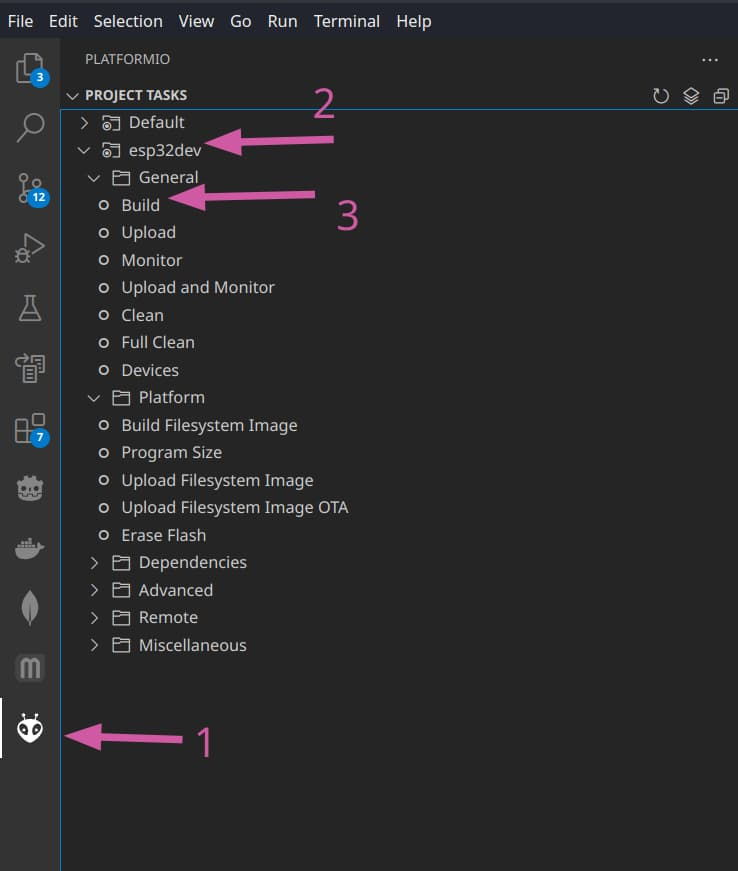
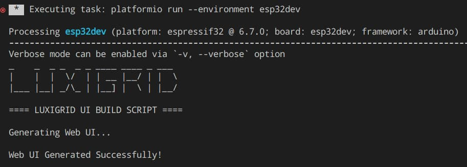
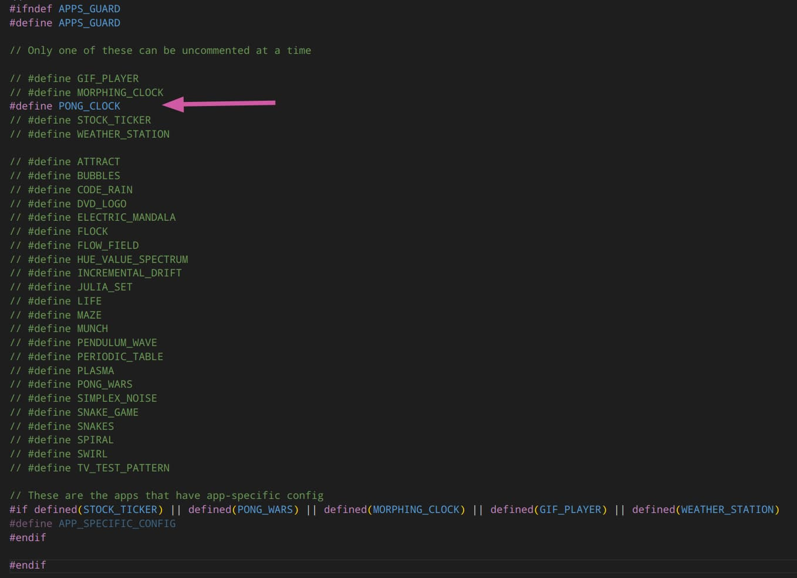
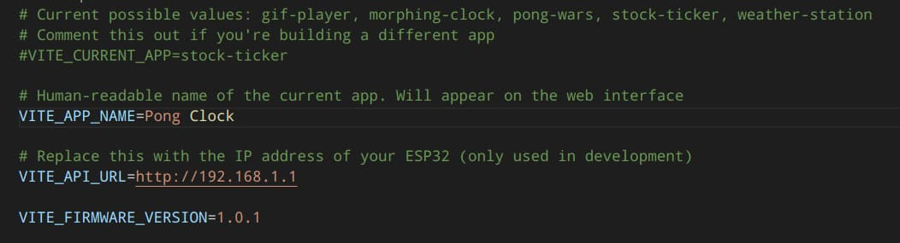
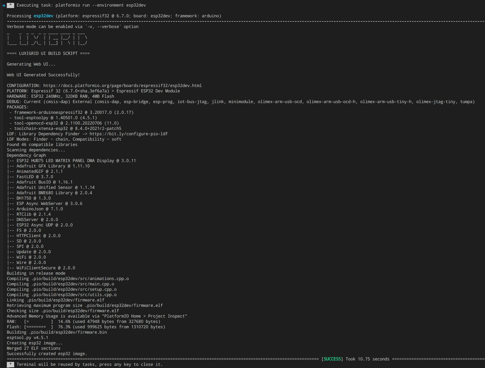
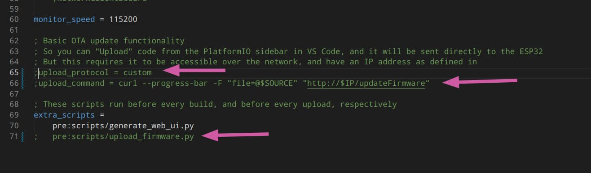

# Luxigrid - Development Documentation

## Project Setup

This repository contains two semi-distinct sub-projects - the C++ firmware for the ESP32, and the browser-based web interface code.

Briefly, the web interface lives in the `/ui` folder, and the C++ project is spread across the `/apps`, `/lib`, and `/src` directories.

The firmware is compiled using the PlatformIO toolchain. The `platformio.ini` file contains the build configuration, including the list of external C++ dependencies.

The `/scripts` directory contains a few Python and shell scripts that help with automating builds of the software.

Working with this code requires a decent amount of experience with C++ and JavaScript. Experience with embedded development is also a plus. It's not the fanciest or best code by any means, but it's more than serviceable.

## Initial Setup

You will need Node.js (at least version 18.20.2) and npm installed on your system. See <https://nodejs.org/en/download> for instructions.

You will also need PlatformIO to be installed on your system, ideally through its VS Code extension, and a compatible version of Python 3. Not as tricky as it might seem - see <https://randomnerdtutorials.com/vs-code-platformio-ide-esp32-esp8266-arduino/> or <https://docs.platformio.org/en/latest/integration/ide/vscode.html> for help.

You might also want to install `curl` if you don't already have it on your system (if you want to use the OTA Upload capability from PlatformIO).

First things first, clone or download this Git repository. Once you have it somewhere on your system, run `npm install` in the `/ui` directory.

Then, you should copy the `.env.example` file and rename the copy to `.env`. Do the same for the `/ui/.env.example` file.

Finally, from the PlatformIO sidebar in VS Code, you should be able to see the `Build` button under the `esp32dev` device folder.



A terminal window should open in VS Code, and the result should look something like this.



You will probably have some errors below this, but as long as it says "Web UI Generated Successfully!" you should be good to move on.

## Setting the Current App

Each time you build the Luxigrid firmware, you need to specify which app you have selected. The reasoning for this is quite simple. With the ESP32's limited resources (especially flash memory) it is not possible to have all of these apps installed at the same time. Further, many of the apps have mutually-exclusive functionality that would conflict.

In order to set the current app, you must uncomment one of the app names in `lib/apps.h`. To enable the Pong Clock, for instance, you would uncomment `#define PONG_CLOCK` like so:



Unfortunately there's also a bit of frontend configuration to be done.

In the `/ui/.env` file, you'll need to at set at least the `VITE_APP_NAME`. In this case, `VITE_APP_NAME=Pong Clock` would be appropriate. For apps with app-specific config (see the list in `/lib/apps.h`) you'll also need to provide a `VITE_CURRENT_APP`. But for now you can leave it commented out. The other environment variables aren't that big of a deal right now. You could leave them as-is or comment them out.



Then that should be all you need. Try building the app from the PlatformIO sidebar "Build" button. You should get something that looks a bit like this. Note the "Web UI Generated Successfully!" at the top, and the "Successfully created esp32 image." at the bottom. If you see any yellow or red text, something may have gone wrong.



So why are they all in the same project? Good question. While there are some obvious benefits to a more encapsulated approach, where each app has its own project, that would lead to a lot of unnecessary code duplication and even more complexity. It's just not worth it, when all of the apps share a significant portion of the codebase. Separating the shared code into a separate library might have made sense, but the existence of the web interface throws a bit of a wrench into that plan.

Ultimately, there may be better ways of structuring a project like this, but this works pretty well, given the constraints. Is it perfect? Does it eliminate code duplication? Does it make it the easiest to create new apps? No, not really. But it works.

## Deploying to the ESP32

### OTA Upload via PlatformIO

Once you've successfully built the Luxigrid firmware, you have a few options for deploying it to the ESP32. One option, provided by this project, is to use the "Upload" button on the PlatformIO sidebar (just under "Build").

If your ESP32 is already running, and already has an IP address on your WiFi network, you can set it as your `ESP32_IP` in the `.env` file. Then as long as it's accessible, and you have `curl` installed on your system, it should automatically upload the new firmware image to the ESP32, replacing the existing firmware. Once the ESP32 reboots, it should be running the new firmware (unless something went wrong, which the terminal might give you some insight on).

### Upload via the Luxigrid Web Interface

Alternatively, the `/.pio/build/esp32dev/firmware.bin` file is what you're looking for. If you have a Luxigrid that's currently running, you can upload that firmware image via the Luxigrid web interface from your browser. Same deal, it should reboot after uploading and installing the new firmware.

### Upload via USB

Otherwise, you'll have to find a way to upload onto the ESP32 via USB. You can comment out the `upload_protocol`, `upload_command`, and `pre:scripts/upload_firmware.py` lines in `platformio.ini`. Something like this (comment lines out by putting a `;` in front of them.)



Then plug your ESP32 into your computer via its Micro USB port.

It's not recommended to have the ESP32 plugged into the Luxigrid circuit board while uploading firmware. It might work, but it's at your own risk. Ideally you should have just the ESP32 board itself plugged in via USB.

You may need to mess with drivers or various things to get the ESP32 code upload to work over USB. Luckily, PlatformIO is pretty good at finding it, and it's pretty configurable if you're having issues. This tutorial from Random Nerd Tutorials should be very helpful if you're running into issues <https://randomnerdtutorials.com/vs-code-platformio-ide-esp32-esp8266-arduino/>.

You'll know when it works, when you can plug the ESP32 into the Luxigrid circuit board (provided it's properly installed in the LED matrix), provide power to the circuit board, and watch the Luxigrid logo pop up.

## Creating a New App

### Basic Requirements

The process of creating a new app is quite involved. Especially if it will have app-specific config. Hopefully the available apps can serve as decent examples should you choose to embark on this journey.

The first thing to note, is you should have a main source file for your app, in the `/apps` (or `/apps/animations`) folder. You'll need to think up a unique name for it, that doesn't conflict with existing app names. Your main source file should have an `.hpp` extension.

You should put a define guide at the top, something like:

```cpp
#ifndef STOCK_TICKER_GUARD
#define STOCK_TICKER_GUARD
```

But make it unique, like `MY_APP_NAME_GUARD`. Also don't forget to put a `#endif` at the end of the file. You will also need to import the Arduino and Luxigrid headers, at the very least.

```cpp
#include "Arduino.h"
#include "../lib/luxigrid.h"
```

You can import other dependencies at the top of your source file. They can be local files, or external dependencies installed by PlatformIO. It's up to you.

All apps need at least a `setup()` and a `loop()` function.

```cpp
void setup() {
    setupMatrix();
}

void loop() {

}
```

The `setup()` function should call `setupMatrix()` at the top, or you won't have access to the rest of the shared features of the Luxigrid firmware.

### App-Specific Config (Optional)

Apps that have app-specific config also need at least the following functions:

```cpp
void retrieveAppConfig() {}
void validateAppConfig() {}
void saveAppConfig() {}
```

There are several examples of apps with app-specific config, some more complicated than others. The config in `/apps/animations/pong-wars.hpp` is two colours, whereas the config in `/apps/stock-ticker.hpp` is much more involved.

Without going into too much detail, or we'd be here all day, each app with app-specific config needs to provide the means to load the config (from a JSON file on the SD card), a function to provide the config to the web interface, a function to provide a function to validate user-provided config from the web interface, and a function to save the config to the SD card.

The ArduinoJson library makes it convenient to store configuration as a JSON file. And various custom `struct`'s can be used to define the types of configuration that will be used in the app.

The app-specific config must be loaded in the `setup()` function, after which the global variable `configIsLoaded` should be set to true. Otherwise, it's up to you what happens in-between. See `/lib/web_server.hpp` for an idea of what the rest of the codebase expects.

### Other Required Setup

You'll also need to update `/lib/apps.h` and add your new app to the list. Add a new line under the APPS_GUARD that looks something like: `#define MY_NEW_APP`. For apps with app-specific-config, you'll need to add your app to the list of apps that have it. The goal is so `APP_SPECIFIC_CONFIG` will be defined only if it needs to be.

You'll also need to modify `/src/main.cpp` so your app's main source file is imported. That might look something like this, but your mileage may vary:

```cpp
#ifdef MY_APP
#include "../apps/my-app.hpp"
#endif
```

### Required Web Interface Setup

Unfortunately this is only half the story (if app-specific config is involved). You'll still need to create a custom section on the web interface to enable users to interact with the app-specific config.

Without app-specific config, you can just set `VITE_APP_NAME` in `/ui/.env` to whatever you want to call your app. And keep `VITE_CURRENT_APP` commented out. You could then set a custom `VITE_FIRMWARE_VERSION`, it's up to you.

### Additional Web Interface Setup (App-Specific Config only)

If your app has its own config, you'll need to provide some frontend code to go along with it. This starts by creating a folder in the `/ui/apps` directory, with the name of your app. If you app is called "My App", for instance, `/ui/apps/my-app` would be a good choice. You will need to provide the name of this folder (in this case `my-app`) as the `VITE_CURRENT_APP` in the `/ui/.env` file.

Inside this folder, you'll need at least a JavaScript file, named something like `/ui/apps/my-app/my-app.js` (same filename as `VITE_CURRENT_APP` but with a `.js` extension).

This JS file must export a function by default. It can be called whatever you want.

This function must setup the app's icon (Finding icons from <https://iconoir.com/> and running them through <https://jakearchibald.github.io/svgomg/> works well), the app's name, the name of the button on the web interface, what settings inputs are available, and how they're interacted with.

In lieu of a step-by-step guide, see `/ui/apps/pong-wars/pong-wars.js` for a fairly minimal example. You can choose to construct the interface using just JavaScript, or you can provide a `.hbs` file and import it into your `.js` file. It must be `.hbs`, even if it's not actually Handlebars, because a custom optimizer (configured in `/ui/vite.config.js`) runs on `.hbs` files.

Like with the C++ side of app-specific config, other than that, it's up to you how you choose to implement the various parts of the web interface. Ideally, you should be able to work with what you have, and not have to pull in external JavaScript dependencies. Because in an embedded environment, they can really add up.

## Tips, Tricks, and Caveats

Admittedly, the process of creating a new app could be easier or better documented. But for the time being, at least unless there is enough interest in streamlining this process, development will be focused on fixing bugs, adding little features here and there, and adding new apps from time to time.

It would be nice to have the ability to create builds of the firmware with features like the Light Sensor, BME680 environmental sensor, RTC, etc. disabled in the code - for people who built a Luxigrid without one or more of them. Currently that's not officially supported (although the light sensor can be disabled from the web interface) but it would be nice.

Double buffering is supported by the ESP32-HUB75-MatrixPanel-DMA library, but the shared codebase isn't drop-in compatible with it. Although for most apps, it shouldn't be necessary in the first place.

If you're experiencing flickering with a custom app, avoid `dma_display->clearScreen()` wherever possible. For one reason or another, flickering seems far less noticeable if you're just updating one part of the screen at a time. Like drawing a black rectangle before updating the text above it.

Technically more fonts are supported, although only two are currently used in the app (`Org_01` is a blocky font, `TomThumb` is a tiny font). But the Adafruit GFX library is compatible with (and includes) many fonts. Worth looking into, if you're interested in a different look.

There are some pretty advanced latent capabilities of this system. An alarm clock comes to mind, or perhaps a Spotify "Now Playing" display. Rest assurred, we at OverScore Media have some ideas in the works. But if you have any ideas of you own, you might be surprised what's possible.

The hardest part about building internet-connected apps is finding a reliable data source. Finnhub and Open-Meteo are great; really appreciate that they're free for personal use. But a lot of interesting project ideas are hampered by bad, non-existent, obsolete, or expensive APIs.

There might be a way to run clock faces from the Clockwise project on a Luxigrid. There may also be potential HomeAssistant or ESPHome integrations.

It'd be interesting to apply this approach to larger or smaller LED matrixes. The Luxigrid PCB technically has "HUB75 (E)" compatibility, for larger matrixes like 64x64. Although the firmware currently expects a 64x32 matrix in most places. There are also matrixes with larger or smaller LEDs. Going any larger than 4mm would push the PCB to (and perhaps beyond) its limits, since it would require more power to operate. Especially the barrel jack, which is rated at 5A. Although a smaller 3mm matrix version should be doable. The hardware would probably work just fine, it would just require new 3D files. Anyway. Maybe one of these days...

But from a software point of view, you'd probably be surprised just how many similar code projects are out there. Search "HUB75" followed by whatever search term. Some work with a Raspberry Pi, and may require resources that the ESP32 can't provide. Many may be compatible with some tweaks, though. And even if they're written in a different programming language, or even if they use an LCD/OLED instead of a HUB75 LED matrix, you'd probably be surprised how straightforward they may be to port to this framework.

Case in point, the Pong Clock app is pretty much a port of <https://github.com/conejoninja/pongclock/>, although the original was written in Go. And Pong Wars was adapted from <https://github.com/anoken/pong-wars-forM5Stack>. The original was written for a modified ESP32 connected to a square LCD display.

Bottom line, as early and complex as it may be - the Luxigrid firmware has been designed with modularity in mind from the start. It abstracts away as much of the repetitive stuff as reasonable, letting you interact with the display and perhipherals in a pretty fluent way. The powerful [ESP32-HUB75-MatrixPanel-DMA](https://github.com/mrcodetastic/ESP32-HUB75-MatrixPanel-DMA) library by @mrcodetastic does a lot of the heavy lifting on the LED side of things, and libraries like [ArduinoJson](https://github.com/bblanchon/ArduinoJson) and [ESPAsyncWebServer](https://github.com/mathieucarbou/ESPAsyncWebServer) make custom web-based configuration fairly straightforward to setup.

## Folder Structure

Here's the complete folder structure of this project, including some descriptions of relevant files. Most source code files also have some kind of comment(s) inside the files themselves, explaining their purpose, etc.

- `/.pio` (auto-generated by PlatformIO; do not source-control)

- `/.vscode` (contains some optional settings to make code editing easier with Visual Studio Code)

- `/apps` (the individual applications live here)
  - `/apps/animations` (for apps that don't rely on external resources or time-keeping)

- `/docs`
  - `/docs/images` (where images are stored for this documentation)

- `/hardware`
  - `/hardware/3d/` (3D Printing files)
    - `/hardware/3d/3MF` (3MF files generated from Prusa Slicer. Use as a reference for the trickier-to-print parts.)
    - `/hardware/3d/SCAD` (OpenSCAD source files. Currently just for the matrix diffusers)
    - `/hardware/3d/STEP` (STEP 3D files. Useful for importing into a 3D slicer or CAD program)
    - `/hardware/3d/STL` (STL files. Useful for importing into some 3D slicers. STEPs are recommended whenever your slicer supports them, but the matrix diffuser is only available in SCAD and STL)
  - `/hardware/pcb`
    - `/hardware/pcb/kicad` (the KiCad project used to create the PCB)
    - `/hardware/pcb/gerbers` (pre-generated Gerber files for PCB manufacturing)
  - `/hardware/3D.md` (3D printing instructions)
  - `/hardware/BOM.md` (Bill of Materials)
  - `/hardware/luxigrid_shopping_list.xlsx` (Spreadsheet for helping with buying parts for building a Luxigrid from scratch)

- `/lib` (various helper/library files, for apps or Luxigrid itself) - all apps use at least these files:
  - `/lib/apps.h`
    - Where the list of apps is defined, and the current app is selected
    - Uncomment out one of the apps at a time, so the compiler will know which one to build
    - Also defines whether the current app has app-specific config (from the web interface)
  - `/lib/luxigrid.h`
    - The main project header. Imports dependencies used in every app, and declares global variables/structs and shared functions
  - `/lib/web_server.hpp`
    - Where the web server code lives. With the exception of app-specific config handlers (defined in app code where applicable)
    - Includes routes for SD card file management, WiFi configuration, time and other global configuration, OTA firmware updates, and a health check route to see if the device is online and fully loaded
  - `/lib/web_ui.h`
    - Auto-generated by `scripts/generate_web_ui.py`; do not source-control
    - Contains a binary array of gzipped data, representing the web interface
    - Is used by the web server to display the web interface
    - When compiling with PlatformIO, the web interface is automatically rebuilt prior to each code compliation

- `/licenses` (licenses and credits for third-party code/libraries used in this project)

- `/scripts` (automation helpers)
  - `/scripts/build_ui.sh` (bash script used in conjunction with `generate_web_ui.py`)
  - `/scripts/generate_elements.py` (used to generate the list of elements for the periodic table app - kept here for future reference)
  - `/scripts/generate_web_ui.py` (ensures the web interface code is up to date before the rest of the C++ code is compiled)
  - `/scripts/upload_firmware.py` (enables automatic OTA firmware uploads from PlatformIO)

- `/src` (main C++ source directory)
  - `/src/animations.cpp` (some animations and user interface elements, like the startup logo and WiFi information splash page)
  - `/src/main.cpp` (basically just `#include`'s for the available apps, based on the current app as set in `/lib/apps.h`)
  - `/src/setup.cpp` (initial setup functions, for the LED matrix, WiFi, time and date, the onboard sensors, and the SD card)
  - `/src/utils.cpp` (various shared utilty functions)

- `/ui` (where the web interface code lives)
  - `/ui/apps` (contains subfolders for the apps with app-specific config)
    - Must have a `.js` file, but may also have other files (like `.hbs` or `.css`)
    - Each app with config must have a folder with its name, and a matching `.js` file inside
    - So `gif-player` has `/ui/apps/gif-player` which houses `gif-player.js`
    - And `pong-wars` has `/ui/apps/ponig-wars` which houses `pong-wars.js`
  - `/ui/dist` (automatically-generated build files; do not source-control)
  - `/ui/lib` (various shared JavaScript utility functions)
  - `/ui/node_modules` (Node.js dependencies; do not source-control)
  - `/ui/templates` (some reusable HTML templates)
    - They're `.hbs` extension, and they have `{{}}` interpolation going on, but it's not actually Handlebars
    - It's just easier to think of them as Handlebars files
  - `/ui/.env.example` (copy and rename this to `/ui/.env`)
    - Set `VITE_CURRENT_APP` for apps with app-specific config (like `stock-ticker`, `gif-player`, etc.) or uncomment for apps without app-specific config
    - Set `VITE_APP_NAME` to a human-readable name of the current app (like `Stock Ticker` or `GIF Player`)
    - Set `VITE_API_URL` to the accessible URL of your ESP32 (during development only)
    - Set `VITE_FIRMWARE_VERSION` to whatever version string you want to display on the web interface (optional)
  - `/ui/.eslintrc.cjs` (ESLint configuration for linting/analyzing JavaScript code)
  - `/ui/.gitignore` (List of files that won't be source-controlled in the `/ui` directory by default)
  - `/ui/.prettierrc` (Prettier configuration for linting HTML)
  - `/ui/generateWebUI.js` (Script that generates `/lib/web_ui.h`)
  - `/ui/index.html` (Main HTML file for the web interface)
  - `/ui/main.js` (Main JavaScript file for the web interface)
  - `/ui/package-lock.json` (Node.js dependencies list - do not edit)
  - `/ui/package.json` (High-level, Node.js dependencies list, for use with `npm`)
  - `/ui/postcss.config.js` (PostCSS configuration)
  - `/ui/style.css` (Global CSS file for the web interface)
  - `/ui/tailwind.config.js` (Configuration for Tailwind.css)
  - `/ui/timezones.json` (JSON data of timezones - adapted from <https://github.com/nayarsystems/posix_tz_db>)
  - `/ui/vite.config.js` (Custom Vite configuration)

- `.clang-format` (settings for auto-formatting C++ code, to keep it stylistically consistent)

- `.env.example` (copy and rename this to `.env`)
  - You can set `ESP32_IP` if you want to OTA upload to the ESP32 directly from PlatformIO

- `.gitignore` (list of files that won't be source-controlled by default)

- `ASSEMBLY.md` (Assembly Instructions)

- `DEVELOPING.md` (this file - Development Instructions)

- `LICENSE.txt` (the main license of this repository)

- `platformio.ini` (contains the build configuration and C++ dependencies)

- `QUICK_START_GUIDE.md` (Quick Start Guide)

- `README.md` (take a guess 😉)
