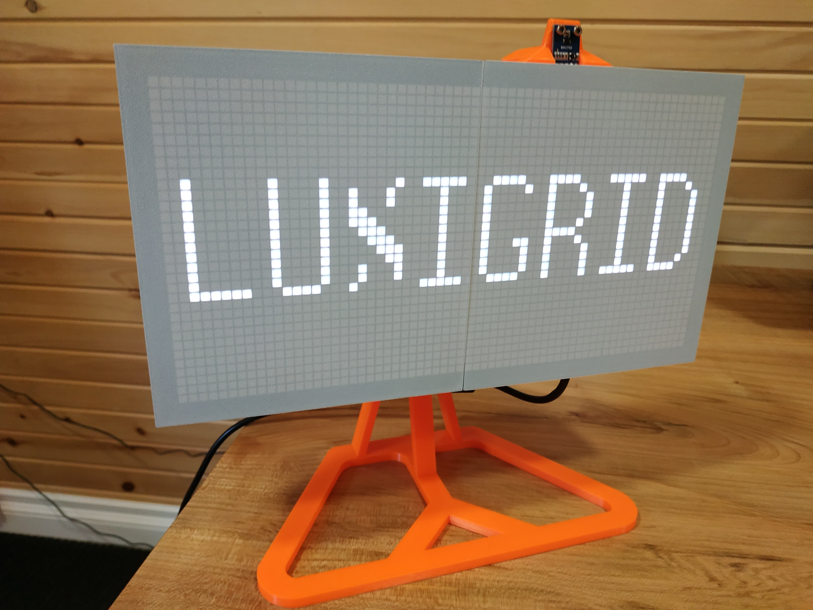

# Luxigrid

Luxigrid is a WiFi-enabled LED matrix for your desk, compatible with an ecosystem of 25+ apps and counting.

The hardware and software are open-source, so you can build one yourself. Or buy one pre-assembled or as a kit from [our website](https://luxigrid.overscore.media)!

## Quick Specs

- 2048 RGB LEDs (in 64x32 grid)
- Browser-Based Web Interface
  - Configure important settings (WiFi, time/date, browse files on SD card, etc.)
  - Upload new apps over WiFi
  - Modify app-specific settings
- Can connect to the Internet (for stocks/weather/news/other info)
- Automatically adjusts its brightness (integrated light sensor)
- Temperature/Humidity Sensor (for an indoor weather station)
- Buzzer for playing alarms, alerts, and chiptunes
- Automatically adjusts for daylight savings time
- Keeps time even when the power goes out (real-time clock on-board)
- Made with readily-available components
- Open-Source
  - Build your own, or modify the code/hardware files to your heart's content
  - Code available under the MIT License
  - 3D printed parts available under the CC-BY-4.0 license
  - PCB Gerbers and KiCad project available and free to use as you see fit

## Quick Start Guide

If you're looking for help setting up your Luxigrid, we've assembled a Quick Start Guide with answers to your most common questions and troubleshooting help.

View the latest version of the [Quick Start Guide](./QUICK_START_GUIDE.md).

For technical support, you can also contact us on [our website](https://luxigrid.overscore.media). Please note that we only provide official support for products purchased from our website. But we'd be happy to chat with you, regardless of whether you've purchased a Luxigrid from our website, or built your own from scratch.

## Technical Details

- 64x32 LED matrix with 4mm pitch
  - Total of 2048 RGB LEDs
  - Compatible with HUB75 protocol
  - Readily available on sites like Aliexpress

- ESP32-DevKitC V4 board
  - ESP32-WROOM-32D processor module
  - WiFi (b/g/n 2.4 GHz) and Bluetooth 4.2
  - 240 MHz Clock Speed
  - 520 KB SRAM (16 KB cache) and 448 KB ROM
  - 1.75 MB of usable flash memory (with OTA updates enabled)
  - Readily available on many sites for under $10
  - Reference: <https://docs.espressif.com/projects/esp-idf/en/stable/esp32/hw-reference/esp32/get-started-devkitc.html>

- Custom PCB
  - Micro SD card reader
  - BME680 Environmental Sensor (temperature, humidity, air pressure)
  - BH1750 Light Sensor (for automatic screen brightness)
  - DS3231 Real-Time Clock (powered by a CR2032 coin cell battery)
  - Piezo Passive Buzzer
  - On/Off Rocker Switch
  - 2.5mm DC Barrel Jack for power

- Power Consumption: 5V DC - 3+ Amps at peak
  - *Please use a power supply capable of delivering at least 4A*

## Assembly Instructions

The process of assembling your own Luxigrid is fairly intensive, but should be documented well enough to be a fair challenge. If you're building one from scratch, you'll need to have purchased the parts from the Bill of Materials, have access to a 3D Printer, and be comfortable with soldering. It's not too difficult, as far as these sorts of electronics projects go, but it may not be for the faint of heart.

[View the full assembly instructions](./ASSEMBLY.md).

Alternatively, you can purchase a Luxigrid in kit form or pre-assembled from [our website](https://luxigrid.overscore.media).

## Development Instructions

The Luxigrid software is split into two semi-distinct components - the C++ firmware that resides on the ESP32, and the HTML/CSS/JavaScript-based web interface that runs on your browser. Since the ESP32 also acts as a web server, there is a level of integration involved. But the most complicated part of the software is its ability to support an arbitrary number of apps. Only one app can be installed on a Luxigrid at a time, and each app must be compiled separately (with its own firmware and web interface). But apps can be swapped between on the fly, thanks to the ESP32's Over-The-Air (OTA) update capability.

Needless to say, the underlying setup to make all of this work is pretty complex. And there are still potential areas for improvement. But we've done what we can to document the process.

[View the full development instructions](./DEVELOPING.md).

Alternatively, you can download the latest compiled versions of the available apps from the official [Luxigrid App Store](https://luxigrid.overscore.media/apps), or the [GitHub Releases page](https://github.com/overscore-media/luxigrid/releases).

## Found an Issue?

Let us know by [creating an Issue](https://github.com/overscore-media/luxigrid/issues) on this GitHub repository. Or if you have a bugfix, feature, or new application you'd like to share, feel free to open a [Pull Request](https://github.com/overscore-media/luxigrid/pulls). We also welcome GitHub stars, forks, and watchers.

For answers to specific questions, or if you just want to chat, drop us a line at [luxigrid.overscore.media](https://luxigrid.overscore.media).

## Credits

OverScore Media wishes to recognize the many giants whose shoulders this project stands upon. Thank you for your contributions to creativity and technology. We hope this project serves as an inspiration to others, like so many have been inspirations to us.

This includes the following individuals and teams. If we've missed any, please let us know. But be assured that their contributions have not gone unappreciated.

Where appropriate, additional copyright notices and software licenses have also been placed in the code. See also [licenses/credits.md](./licenses/credits.md).

### Software Libraries

- [ESP32 HUB75 LED Matrix Panel DMA Display](https://github.com/mrcodetastic/ESP32-HUB75-MatrixPanel-DMA) by @mrcodetastic on GitHub
- [Adafruit GFX Library](https://github.com/adafruit/Adafruit-GFX-Library)
- [Adafruit BusIO](https://github.com/adafruit/Adafruit_BusIO)
- [Adafruit Unified Sensor](https://github.com/adafruit/Adafruit_Sensor)
- [Adafruit BME680 Library](https://github.com/adafruit/Adafruit_BME680)
- [Adafruit RTClib](https://github.com/adafruit/RTClib)
- [BH1750](https://github.com/claws/BH1750) by @claws on GitHub
- [ESP Async WebServer](https://github.com/mathieucarbou/ESPAsyncWebServer) originally by [@me-no-dev](https://github.com/me-no-dev/ESPAsyncWebServer), then forked by [@yubox-node-org](https://github.com/yubox-node-org/ESPAsyncWebServer), then forked by [@mathieucarbou](https://github.com/mathieucarbou)
- [ArduinoJson](https://arduinojson.org/)
- [AnimatedGIF](https://github.com/bitbank2/AnimatedGIF) by @bitbank2
- [FastLED](https://github.com/FastLED/FastLED)

### Projects

The following projects have served as direct inspiration for parts of the Luxigrid firmware.

- [myClock](https://github.com/dragondaud/myClock) by @dragondaud on GitHub
- [Pong Wars for M5Stack](https://github.com/anoken/pong-wars-forM5Stack) by @anoken on GitHub
- [PONG clock](https://github.com/conejoninja/pongclock/) by @conejoninja on GitHub
- [Aurora](https://github.com/pixelmatix/aurora) by Jason Coon
- [minimalUploadAuthESP32](https://github.com/CelliesProjects/minimalUploadAuthESP32/blob/master/minimalUploadAuthESP32.ino) by @CelliesProjects on GitHub

### Development Tools

- [Arduino](https://www.arduino.cc/)
- [ESP32](https://www.espressif.com/en/products/socs/esp32)
- [PlatformIO](https://platformio.org/)
- [Visual Studio Code](https://code.visualstudio.com/)

### Web Development Tools

- [Tailwind.css](https://tailwindcss.com/)
- [Vite](https://vitejs.dev/)
- [JSDOM](https://github.com/jsdom/jsdom)
- [ESLint](https://eslint.org/)
- [ESLint Config XO](https://github.com/xojs/xo)
- [PostCSS](https://postcss.org/)
- [vite-plugin-html](https://github.com/vbenjs/vite-plugin-html)
- [vite-plugin-singlefile](https://github.com/richardtallent/vite-plugin-singlefile)
- [CSSNano](https://github.com/cssnano/cssnano)
- [Iconoir](https://iconoir.com/)

### Data Sources

- [Open-Meteo](https://open-meteo.com/) (for weather data)
- [Finnhub Stock API](https://finnhub.io/) (for stock data)
- [Wikipedia](https://www.wikipedia.org/) (for periodic table of elements data)
- <https://github.com/nayarsystems/posix_tz_db> (for timezone data)

### 3D Software

That's right. Luxigrid's 3D-printed parts were designed with free and open-source software!

- [FreeCAD](https://www.freecad.org/)
- [OpenSCAD](https://openscad.org/)
- [PrusaSlicer](https://www.prusa3d.com/page/prusaslicer_424/)

### 3D Models

This excellent 3D model was used as the basis for the desk mount. Our modified version is a bit taller, and uses an M4 bolt instead of an M5.

- [Vesa 75x75 monitor stand](https://www.thingiverse.com/thing:3808242) by @choosecool on Thingiverse
  - Licensed under the [Creative Commons - Attribution license](https://creativecommons.org/licenses/by/4.0/).

### Tutorials

These helpful tutorial creators have served as invaluable references during various parts of the concept, design, and production phases of this project. Thanks for sharing your knowledge!

- [Random Nerd Tutorials](https://randomnerdtutorials.com/) for a wealth of electronics tutorials
- [@Swiss_Cheese on YouTube](https://www.youtube.com/@Swiss_Cheese.) for PrusaSlicer tips and tricks
- [@ontherundesign's Hirth Joint](https://www.thingiverse.com/thing:2937436) FreeCAD Tutorial
- [RGB Panel Hookup Guide](https://learn.sparkfun.com/tutorials/rgb-panel-hookup-guide) by Sparkfun
- [Adafruit GFX Library Guide](https://cdn-learn.adafruit.com/downloads/pdf/adafruit-gfx-graphics-library.pdf) by Phillip Burgess

### Inspirations

These are some of the hardware projects and commercial products that have served as indirect inspirations for the development of Luxigrid. There were times when it seemed impractical to complete, but the existence of these projects gave us hope that it could be done. Hopefully this project can serve as such an inspiration to others. Your dreams may not be so unachievable, after all! :)

- [Tidbyt](https://tidbyt.com/)
- [Clockwise](https://clockwise.page/)
- [Adafruit Matrix Portal](https://www.adafruit.com/product/4745)
- [Pico RGB Matrix P3 64x32](https://www.waveshare.com/wiki/Pico-RGB-Matrix-P3-64x32) by Waveshare
- [Pixel Art Matrix Display](https://www.printables.com/model/600039-pixel-art-matrix-display) by @Till_312394 on Printables
- [Pixel Art with 64 LED Matrix WS2812B - v2](https://www.printables.com/model/946221-pixel-art-with-64-led-matrix-ws2812b-v2-new-led-di) by @Regis on Printables
- [ESP32 HUB75 LED Matrix Driver](https://github.com/rorosaurus/esp32-hub75-driver) by @rorosaurus on GitHub
- [ESP32 I2S Matrix Shield](https://www.tindie.com/products/brianlough/esp32-i2s-matrix-shield/) by Brian Lough
- [ESP32 D1 Mini D1 RGB Matrix Shield](https://github.com/hallard/WeMos-Matrix-Shield-DMA) by @hallard on GitHub
- [ESP Pixel Matrix](https://github.com/hanneslinder/esp-pixel-matrix) by @hanneslinder on GitHub
- [PxMatrix](https://github.com/2dom/PxMatrix) by @2dom on GitHub
- [HUB75 Pixel Art Display](https://github.com/mzashh/HUB75-Pixel-Art-Display) by @mzashh on GitHub
- [RGB Matrix Panel Shield for ESP32](https://www.tindie.com/products/lightwell/rgb-matrix-panel-shield-for-esp32/) by LIGHTWELL
- [ESP8266 RGB Matrix Cable Version](https://github.com/mike-rankin/ESP8266_RGB_Matrix_Cable_Version) by Mike Rankin
