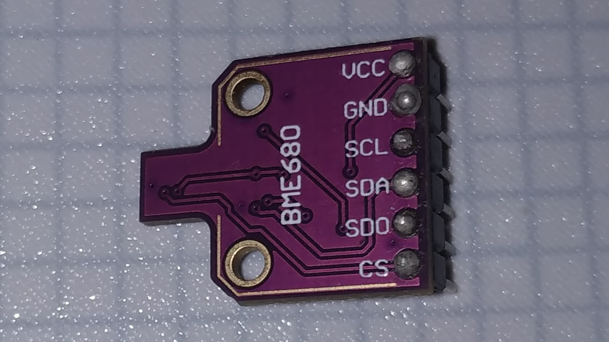
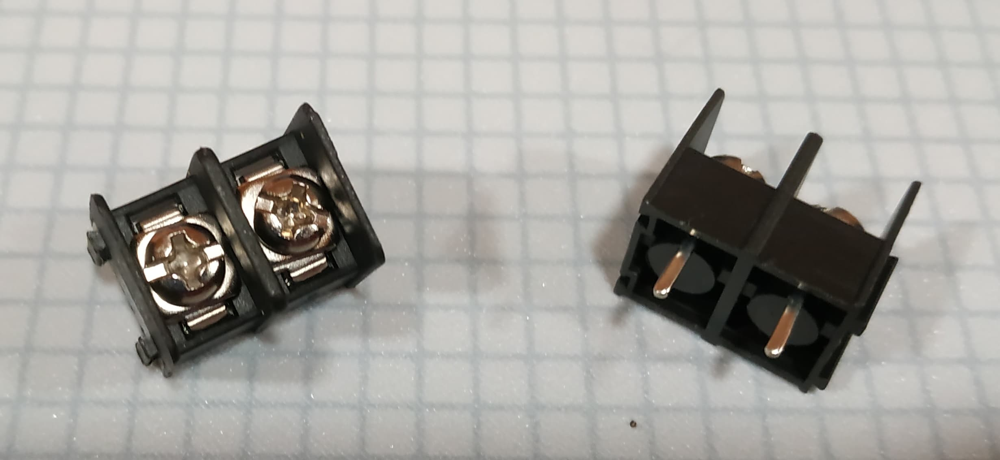

# Luxigrid - Bill of Materials

This is the list of the parts/tools you may need to assemble a Luxigrid of your own. Fair warning, it's a fairly long list. But we've gone to considerable lengths to ensure the availability/reasonable price of these components. Hopefully they're still relatively easy to find, if and when you choose to embark on this adventure.

You can also purchase a Luxigrid in kit form or pre-assembled from [our website](https://luxigrid.overscore.media) 😉.

**Please Note:** OverScore Media does not guarantee that any of this information is accurate or up-to-date. It is provided for informational purposes only, in the hope that it will be useful. Any images are for illustration only. If you choose to follow these instructions, you do so at your own risk. This is just to let you know what you might be in for. Please be careful.

We've also provided a handy [Shopping List](./luxigrid_shopping_list.xlsx) spreadsheet that you may find helpful.

## Modules

- **LED Matrix**
  - P4 64x32 LED Matrix
  - 256x128mm
  - HUB75
  - Your mileage may vary, but Muen LED/MuenShop on Aliexpress has good deals
  - *Must be compatible with the ESP32 HUB75 MatrixPanel DMA Library* - see <https://github.com/mrcodetastic/ESP32-HUB75-MatrixPanel-DMA?tab=readme-ov-file#supported-panels>

- **ESP32-DevKitC V4 Board**
  - You're looking for a **38-pin** ESP32 board that has an **ESP32-WROOM-32D** chip and **Micro USB**
  - Look for the one that matches this picture *exactly*, since the Luxigrid PCB is built around it
  - They shouldn't be too hard to find, if you know what you're looking for - i.e., this:

- **DS3231 RTC Module**
  - These RTC modules are fairly easy to find
  - Some come with a battery included, but you're probably better off finding a battery elsewhere (more on that below)
  - Note: To install it on the Luxigrid PCB, you'll need to solder 4 male header pins facing downwards (as shown in the picture)
  - Many modules come with 4 extra male header pins for this purpose
  - Also, don't mind the subpar soldering job on this and other parts. These were from an early test - we've had more practice since then.

- **BME680 Module**
  - Unfortunately, this module can be quite pricey, as the sensor itself is about $4 CAD. Try to find one under $10 CAD, if possible.
  - Granted, *good luck* finding anywhere near as accurate/powerful a sensor for the price point that can do temperature and humidity.
  - It must have VCC, GND, SCL, SDA, SDO, and CS pins as shown. Although Luxigrid doesn't use the SDO and CS pins; just the other pins for the I2C interface
  - For whatever reason, these are usually purple. But you might find one in black or other colour. As long as it has the same board shape and pinout, you should be fine.
  - You will need to solder a 6-pin (or at least a 4-pin; SDO and CS are unused) male header to the pins as shown, with the "back" side of the board facing up. The orientation is very important.

- **Micro SD Card Module - 3.3V Logic**
  - This is unfortunately one of the trickier ones to find - not because there aren't many out there, but because there are many incompatible products that look similar.
  - This module you want is very small, and it runs off **3.3V logic**. Many Arduino-compatible SD card modules use 5V logic
  - You can generally tell them apart, because the 5V ones are a bit bigger, and they have a little black part with three "legs" and a "hat" - that's the voltage regulator. You don't want one of them.
  - "Mini TF Card Module" might help in your search
  - Try not to get dinged on shipping, but these shouldn't be more than about $1.50 CAD.
  - You're going to want to solder 6 male header pins (often included) facing up from the top
  - So if you put the module on its back (the side without the micro SD card slot) the pins should be pointing down

- **BH1750 Module**
  - These are readily available, often under the name "GY-302"
  - It's a rectangular board with a BH1750 chip, five pins, and two screw holes
  - You'll need to solder 5 male header pins facing away from the front, where the sensor is (or at least 4; the ADDR pin is unused by Luxigrid)
  - The little black rectangle on the front-middle of the board is the sensor itself

## Passive Components

- **Resistors - 1K** - x2
  - You'll need two 1K (that's one Kiloohm) resistors for hooking up the buzzer
  - The main requirements are the 1K resistance and that they're through-hole components
  - Resistors are generally a pretty generic part, but these were the ones we found. Anything similar to these is probably going to work: [MFR50SFTE52-1K](https://www.mouser.ca/ProductDetail/603-MFR50SFTE52-1K)

- **Transistor - S8050** - x1
  - You're looking for an NPN transistor with a through-hole footprint
  - There are many good options out there, but we found these ones work really well. The ones with "kinked leads" make soldering them a bit easier: [SS8050DTA](https://www.mouser.ca/ProductDetail/512-SS8050DTA)
  - It doesn't necessarily have to be an S8050, but that part is known to work

- **Passive Piezo Buzzer** - x1
  - These are a pretty generic part, but you definitely want a **passive** buzzer, not an active buzzer
  - Generally the passive ones have a little green circuit board on the bottom
  - You may have to slightly bend the legs to make it fit the PCB, but that should be fine if you're careful

- **DC-Rated Miniature Rocker Switch** - x1
  - These were a royal pain to find, but they're a perfect fit: [Wurth 471002268143](https://www.digikey.ca/en/products/detail/w%C3%BCrth-elektronik/471002268143/9950822)
  - You may also have success with the sister model, the [Wurth 471002268142](https://www.digikey.ca/en/products/detail/w%C3%BCrth-elektronik/471002268142/9950821), which just has a different off symbol.
  - These are fairly expensive, at ~$5 CAD per switch, but they are actually rated for DC current. The majority of miniature rocker switches are only rated for AC, and there's no formula to calculate a safe DC rating for an AC switch.
  - If you decide on a different switch, you may have to adjust the 3D model of the left backplane of the Luxigrid enclosure to fit it. But we would strongly recommend not going with a switch that has not been rated for at least 10A DC. For reference, Luxigrid operates at 5V DC, and may draw upwards of 3A when the screen is fully lit.

## Connectors

- **Spade Terminals/Barrier Terminal Block (1x2, 7.62mm)** - x1
  - You will need a 2-pin barrier terminal block, with 7.62mm, to connect the LED matrix to the Luxigrid PCB

- **Screw Terminals (1x2, 5mm)** - x1
  - You will need a 2-pin screw terminal block with 5mm pitch, to wire up the power switch
  - We recommend the [Same Sky TB003-500-P02BE](https://www.mouser.ca/ProductDetail/490-TB003-500-P02BE) or a similar product. You need one that's able to support 18 AWG wire, and the higher the voltage and current rating, the better.

- **DC Barrel Jack** - x1
  - The barrel jack provides power to the PCB. It depends on what power supply you're using, but getting one with an inner diameter of 2.50mm, and an outer diameter of 5.50mm is ideal
  - Don't cheap out on the barrel jack. We recommend the [Same Sky PJ-002BH](https://www.digikey.ca/en/products/detail/same-sky-formerly-cui-devices/PJ-002BH/408447) or something equivalent. It has a DC voltage rating of 24 V, and a current rating of 5A. Most cheap/generic barrel jacks are only "rated" (if they're actually rated at all) at 2.5A or less. Like the power switch, you don't want such a critical part melting on you.

## Headers

You will need some female 2.54mm "Dupont" style PCB headers, to connect parts like the sensors and ESP32 to the PCB.

- *Note: This assumes the Modules above all came with male header pins, as shown in the pictures above, which is likely. Otherwise, you would have to order those separately*

- 2x8 Female Header Block - x1

- 1x4 Female Header Block - x3

- 1x6 Female Header Block - x1

- 1x19 Female Header Block - x2

- *Pro Tip:* You're probably going to be out of luck finding 1x19 female header pins. But with a bit of practice, you can cut one pin off a 1x20 pin block with side cutters or a hobby knife (be careful) and sand it down a bit until it's flush.
  - Once you know how to do that, you can buy **1x40** female header blocks for pretty cheap. So you don't necessarily have to find these specific sizes, once you learn how to cut them down to size
  - You should still probably get a 2x8 female header block, though. The bigger blocks are harder to cut, and you'll want the PCB to line up properly with the LED matrix

You could technically solder certain parts directly onto the Luxigrid PCB, but the 3D printing files were not designed with that in mind. And with headers, you can more easily replace a specific component if it ever fails, instead of having to replace the whole board, which is probably more convenient and slightly less wasteful.

## Fasteners

- You're looking for the following sizes/quantities of metric "Socket Head Cap Screws" or "Hex Socket Cap Screws" or something like that. They're pretty ubiquitous.

- **M3 x 10mm** - x16
  - These hold the main part of the Luxigrid enclosure together, and keep the PCB in place
  - Eight of them will be screwing into threaded inserts on the matrix diffusers, six will be screwing into the integrated threads on the LED matrix itself, and two will hold the PCB

- **M2.5 x 8mm** - x4-8
  - These are for attaching the BH1750 light sensor (x2), the micro SD card module (x2), and the RTC and BME680 sensor. For the RTC and BME680 sensor, you may only want one screw, or none at all

- **M4 x 12mm** - x4
  - These are for attaching the desk mount bracket to the back of the right backplane, via the threaded inserts

- **M4 x 30mm** - x1
  - This is for the desk mount. It acts like a peg to hold it together.
  - *You can use a longer screw than 30mm, because it will just stick out the other end of the desk mount, but at least 30mm is recommended*

- **M4 Nut** - x1
  - The specific shape of nut probably won't matter, as long as it has M4 threads and isn't too big
  - But you're not looking for a nylon lock nut, just a regular M4 nut
  - This is for the desk mount, by the way

- *Pro Tip:* Buy these types of fasteners in bulk or as a kit when you can, for decent savings down the road. Especially if you plan on doing more 3D printing projects, having some metric hex cap screws is never a bad idea. You can get a lot of mileage off a 100-pack of M3 x 10mm's or M4 x 12mm's, for instance.
  - You can commonly see the black carbon screws or stainless steel screws. Stainless is a *bit* more expensive and it won't blend in if you made a black Luxigrid, but it's shinier and won't rust as easily. Your call; neither's a bad choice.

## Hookup Wire

- **18 AWG Wire for the Power Switch**
  - Flexible copper wire with silicone insulation is probably the easiest to work with in this case
  - You only need about 10-20cm to hook up the power switch, but you may find it easier to buy it by the meter

- **Female-to-Male Dupont Cables (20mm)** - x4
  - These colourful pre-made cables are often used with breadboard and Arduino projects
  - You need four of them to hook up the BH1750; they're often available in packs of 10-40 for a reasonable price
  - Make sure you get the ones with one female end and one male end

## Other Components

- **Luxigrid PCB**
  - See the [Assembly Instructions](../ASSEMBLY.md) for more information on procuring and assembling the PCB
  - Here are pictures of the front and back of the board, before populating it with parts

- **5V 4A Power Supply**
  - You're looking for something that safely outputs at 5V DC at at least 4A (or 5A+)
  - Luxigrid pulls upwards of 3A when the screen is completely lit and at full brightness.
  - Look for something with a 2.5mm barrel connector
  - You may require an AC extension cord to extend the wall side of the power supply. We do not recommend extending the DC/barrel connector side of the cable, or putting an inline switch on it, etc. They are likely not rated for this amount of current.

- **CR2032 Coin Cell Battery**
  - For the Real-Time Clock module, to keep the time even when your Luxigrid is off, or during a power outage
  - Some RTC modules come with batteries, but you can find these almost anywhere
  - It's probably cheaper to buy this separately, instead of buying an RTC module that comes with a battery

- **Micro SD Card**
  - *At least 4GB recommended*
  - The size of the card you need is basically determined by how many big GIFs you might want to put on it
  - Other things (configuration files, etc.) don't take up much space at all, but GIFs can be pretty big depending on their length/quality

- **Heated Inserts**
  - The diffusers and right backplane require heated inserts
  - We recommend **6mm M3 w/ 4.5mm OD** inserts (of which you'll need **8**) for the diffusers and **5mm M4 w/ 6mm OD** inserts for the right backplane (you need **2** of these)
  - There are many types, of varying quality and effectiveness. Try to find ones designed with 3D printing in mind - not just injection molding. If they're tapered near the end, with two sets of opposing knurls on the outside, they will probably work. But your mileage may vary.
  
  

  

- **Stainless Steel Filter Screen** (optional)
  - If you want to cover the holes in the back of the enclosure with a filter to mitigate dust build-up, there are various options
  - You want something with holes large enough to allow some airflow, but small enough to block most dust - and something that won't tear easily.
  - A **"120 Mesh" Stainless Steel Filter Screen** is what we usually go with. You should only need about **150 square centimetres** for the four filter plates. You can usually buy it by the square meter
  - You will need to cut it into 4 rectangular pieces, roughly 4 cm x 9.5 cm.
  - These may be difficult to find, but they are out there on sites like Aliexpress if you're persistent.

## Tools/Consumables

- **Allen Keys/Screwdriver**
  - M2.5
  - M3
  - M4
  - *Pro Tip:* If Allen Keys frustrate you, look into a "Precision Screwdriver Set" that comes with metric hex bits.
  - You'll also need some precision Phillips bits for screwing down some connectors, but you may already have some lying around.

- **Wire Strippers/Cutters**
  - For preparing the wire to hook up the power switch, you should use strippers capable of stripping 18 AWG gauge wire
  - You might be able to use this to cut the header blocks, if that's your plan. Otherwise you'll also need **side cutters**.

- **Soldering Iron**
  - Any iron will technically do, but at least basic temperature control is a major plus
  - We used a Hakko FX-888D for what it's worth, but a cheaper iron should do the trick - if you're patient and have at least a bit of practice
  - Also Flux. Use Lots of Flux to help the solder flow properly (you can clean it off finished parts with a toothbrush and some rubbing alcohol - there are many good tutorials for that out there) - just don't brush your teeth with it after! 😂

- **Heated Insert Tips for Soldering Iron**
  - Certain 3D printed parts of the Luxgrid enclosure (the matrix diffusers and the right backplane) require installing heated inserts.
  - A convenient way to install these is to swap the tip of your soldering iron with a special tip dedicated to heated inserts.
    - You'll need at least two heated insert tip sizes - for M3 and M4 inserts
    - You may be able to buy an adapter that fits onto the end of your iron, so you can swap out the M3 or M4 insert tip
  - Just be careful when changing the tips, that your soldering iron isn't on or still hot!
  - It takes a bit of practice, but it's not too difficult once you get the hang of it - and there are many helpful resources out there for threaded inserts and 3D printing

- **Hot Glue Gun**
  - If you want to install the optional dust screens on the back of the enclosure, you'll need some kind of glue to attach them
  - Hot Glue is pretty convenient, but there are other options
  - Just make sure whatever you're using can stick to the plastic you printed with, and that it doesn't eat away at it. Some adhesives are corrosive or reactive with certain types of palstic.
  - You might go through a few sticks of hot glue in the process.

- **Multimeter**
  - For testing and troubleshooting electrical connections, a multimeter is a good tool to have on hand. Even a cheaper one should do the trick. Even if you're just using it for continuity tests or voltage measurements, it can help to eliminate some pesky variables in the event something goes wrong. If you want some features/precision, or you want to measure the amperage draw of anything, you may want a slightly more sophisticated model, although you shouldn't have to spend too much to get something usable enough for this project. The cheapest ones often can't safely measure more than a few hundred mA of current, which parts of Luxigrid's circuits can easily draw.

## 3D Printing Requirements

- **3D Printer**
  - Obviously 😂
  - Use whatever you're comfortable with, but Luxigrid was designed to be printed on an FDM printer with PLA or PETG filament
  - Some of the parts, especially the diffusers, may be difficult to print unless you have a well-tuned printer with reasonable dimensional accuracy and excellent build surface adhesion
  - We used a Prusa MK3.9 during the design process, but there are many good options out there
  - See the [3D Printing Instructions](./3D.md) for more information

- **Filament**
  - **~400g** needed to print entire enclosure
    - Assuming 0.4mm nozzle and 0.20mm layer height, and using recommended supports/orientations from 3MF files
  - **White Filament** (minimum 12g used for the diffusers)
  - **Black Filament** (minimum 38g used for the diffusers)
  - **Another Colour** (unless you want a white or black Luxigrid, in which case you're set)

- **Filament Notes:**
  - Use as bright white and as dark black as you can find. The diffuser effect won't work with any other colours. The accent colour, however, can be whatever you like
  - You can use whatever kind of filament you like, but at least the diffuser has to be made from filaments that will stick to each other (ideally the same kind of filament)
  - Your mileage may vary, but we've found that PLA won't stick to PETG at all, and PVB *might* stick to PLA well enough to finish a print, but it'll have to be glued together later, which could get messy.

- **Sandpaper (recommended)**
  - A few of the parts require printing with brims and/or support material which may leave minor surface defects upon removal
  - It's a good idea to have some sandpaper handy (of various grit levels, depending on your pateience and the amount of material you need to remove)

- **Post-Processing/Deburring Tools (recommended)**
  - For those ornery stray bits of plastic, some kind of metal deburring tool can come in handy
  - A tool called a "Double Sided Prying Tool" or "Metal Spudger" can also come in handy for removing brims or scraping away at excess plastic
